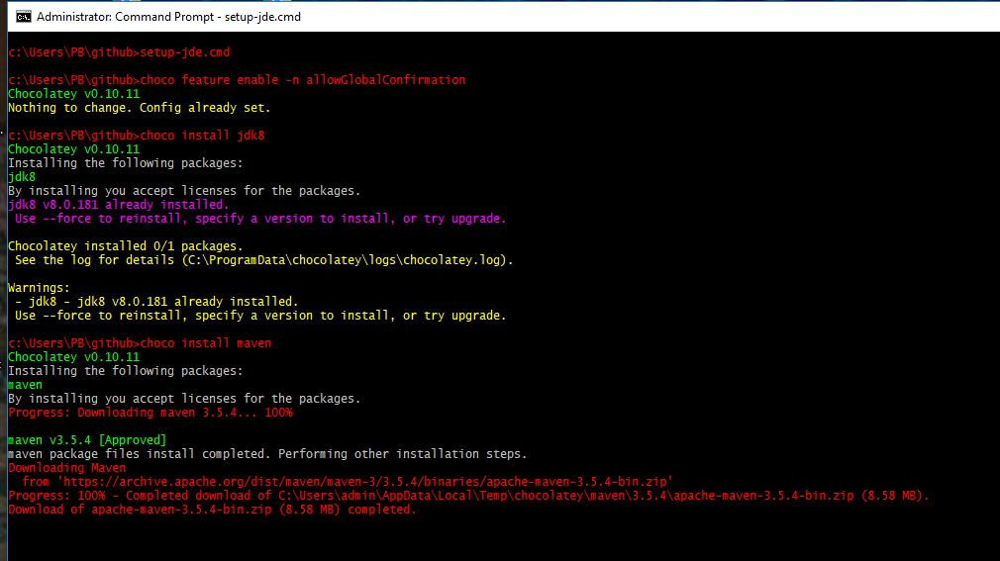
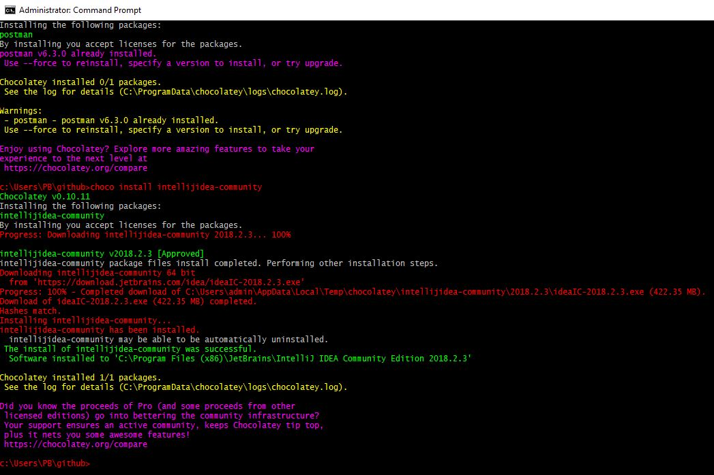

# setup-jde-using-chocolatey
Setup Java Developer Environment on Windows using Chocolatey

## What is Chocolatey ?
***Chocolatey*** is a _package manager_ for Windows similar to `Homebrew` on the MacOS, with features to _install_, _upgrade_ and _uninstall_ Windows applications.
***Chocolatey*** works with all the existing Windows software installation technologies, runtime binaries and zip archives. It supports unattended and scripted package management with automatic configuration of environment/PATH.

In this article I am using _Chocolatey_ script to create a typical ***Java Developer Environment*** on a Windows machine.  
This script is recommended to be under version control and used to setup consistent developer environments for a team.

## Steps
1. [Install _Chocolatey_](https://chocolatey.org/install)

2. Verify the installation is successful by typing `choco -?` in a Windows Command window.

3. Open a Command window using the _Run As Administrator_ option.

4. Run `setup-jde.cmd` in the Command window to install the runtime (_JDK8_), build tools (_maven, gradle_), SCM (_git_), utilities (_putty, curl, postman_) and the IDE (_IntelliJ community edition_) on the developer's Windows computer.

    `setup-jde.cmd`

    ```
    choco feature enable -n allowGlobalConfirmation

    choco install jdk8
    choco install maven
    choco install gradle
    choco install git.install
    choco install putty.install
    choco install curl
    choco install postman
    choco install intellijidea-community
    ```
    
    ***Script execution start***
      
   
    ***Script execution complete***
     
    
## Notes
1. `C:\ProgramData\chocolatey` contains the `choco.exe`.

2. Command syntax: `choco <operation> <application-name>`
    -  `operation` is `install`,`uninstall` or `upgrade`
    -  `application-name` is obtained from `https://chocolatey.org/packages`

3. `https://chocolatey.org/packages` contains the details of the applications that can be installed using `choco install`

4. The `uninstall-jde.cmd` is used for uninstalling all the applications that were installed using the `setup-jde.cmd`

