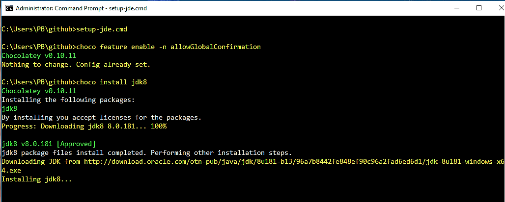

# Setup Java Developer Environment using Chocolatey
## What is [Chocolatey](https://chocolatey.org/) ?
***Chocolatey*** is a _package manager_ for Windows similar to **_Homebrew_** on the MacOS, with features to _install_, _configure_, _upgrade_ and _uninstall_ Windows applications.
***Chocolatey*** works with all the existing Windows software installation technologies, runtime binaries and zip archives. It supports unattended and scripted package management with automatic configuration.

I will be using _Chocolatey_ scripts to create a typical ***Java Developer Environment*** on a Windows machine.  
These scripts can be used to ***setup, update*** or ***teardown*** the Java developer environments on a Windows machine.

## Steps
1. Install **Chocolatey**  
   open a command window using the _Run As Administrator_ option and, execute [setup-chocolatey.cmd](https://github.com/pbelathur/setup-jde-using-chocolatey/blob/master/setup-chocolatey.cmd).

2. Verify the installation is successful by typing `choco` in the command window.  
     

3. Run [setup-jde.cmd](https://github.com/pbelathur/setup-jde-using-chocolatey/blob/master/setup-jde.cmd) in the same command window to install the runtime (_OpenJDK 11_), build tools (_maven, gradle_), SCM (_git_) and utilities (_putty, curl, postman_, _IntelliJ community edition_) on the developer's Windows computer.

    contents of the`setup-jde.cmd`

    ```
    choco feature enable -n allowGlobalConfirmation
    
    choco install -y openjdk maven gradle git atom putty curl postman  db-visualizer 7zip intellijidea-community
    ```

    ***Script execution start***
      

    ***Script execution complete***
    

4. Verify the installed applications of the _Java Developer Environment_.

## Notes

1. [Chocolatey Installation Details](https://chocolatey.org/install)

2. `C:\ProgramData\chocolatey` contains the `choco.exe`.

3. Command syntax: `choco <operation> <application-name>`
    -  `operation` is `install` or `uninstall` or `upgrade`
    -  `application-name` is obtained from `https://chocolatey.org/packages`

4. `https://chocolatey.org/packages` contains the details of the applications that can be installed using `choco install`

5.  [uninstall-jde.cmd](https://github.com/pbelathur/setup-jde-using-chocolatey/blob/master/uninstall-jde.cmd) is used to _teardown_ the Java Developer Environment.

6. Installation log: `C:\ProgramData\chocolatey\logs\chocolatey.log`
